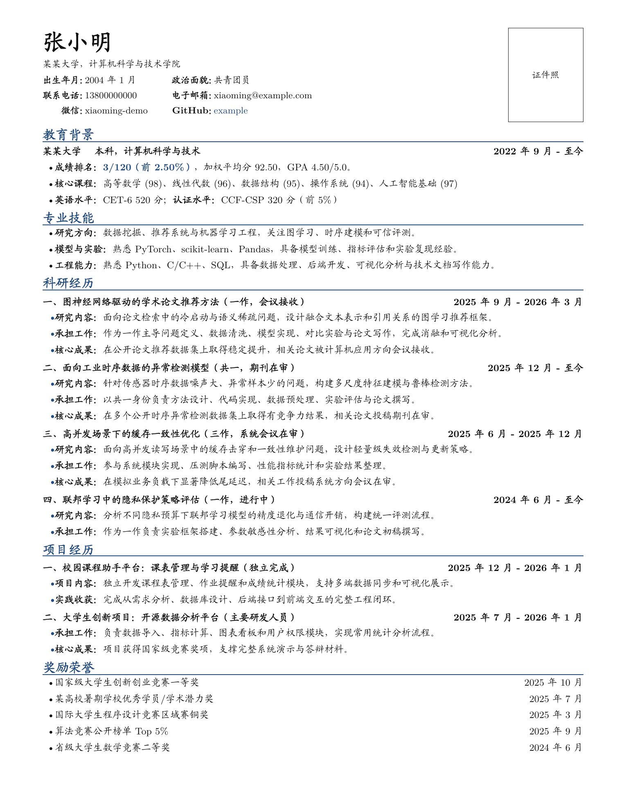

# 保研简历模板

[](https://github.com/MuQY1818/baoyan-resume-template/stargazers)
[](LICENSE)
[](https://github.com/MuQY1818/baoyan-resume-template/generate)

一个偏传统中文简历风格的 LaTeX 模板，适合保研、夏令营、预推免、导师套磁等场景。模板采用深蓝色章节标题、横线分隔、右上证件照区域、经历标题与日期右对齐的排版。

> 示例内容均为虚构匿名信息，仅用于展示版式。

## 适合场景

- 保研、夏令营、预推免、导师套磁等中文申请材料。
- 科研经历较多，希望在一页内突出教育背景、论文项目和奖励荣誉。
- 想使用 LaTeX 维护简历，但不希望版式过于花哨。

## 示例图



示例图由本仓库匿名 LaTeX 示例渲染得到，不包含真实个人信息。

## 文件结构

```text
.
├── main.tex          # 简历正文示例，直接改这里
├── resume_blue.cls   # 模板样式
├── assets/
│   └── preview.png   # README 示例图
├── .latexmkrc        # latexmk 编译配置
├── LICENSE
└── README.md
```

## 使用方法

点击右上角 **Use this template** 可以直接基于本仓库创建自己的简历仓库。

安装 TeX Live 或 MacTeX 后，在项目根目录运行：

```bash
latexmk -pdfxe main.tex
```

生成文件为 `main.pdf`。

如果需要清理中间文件：

```bash
latexmk -c
```

## 修改建议

- 个人信息：在 `main.tex` 顶部修改姓名、学校、联系方式、GitHub 等字段。
- 证件照：默认使用占位框。若要换成照片，可把占位框替换为：

```tex
\includegraphics[height=3.0cm]{photo.png}
```

- 科研经历：建议使用“研究内容 / 承担工作 / 核心成果”的结构，避免堆叠大段文字。
- 一页控制：优先压缩长句和低相关奖项，不建议盲目缩小字号。
- 脱敏：公开前请检查电话、邮箱、微信、导师姓名、未公开论文标题、实验数据等敏感信息。

如果这个模板对你有帮助，欢迎 Star，也欢迎分享给正在准备保研材料的同学。

## 字体说明

模板优先使用 `KaiTi_GB2312`。如果系统没有该字体，会回退到 TeX Live 自带的 Fandol 楷体。不同系统的字体渲染可能略有差异。

## License

MIT License
